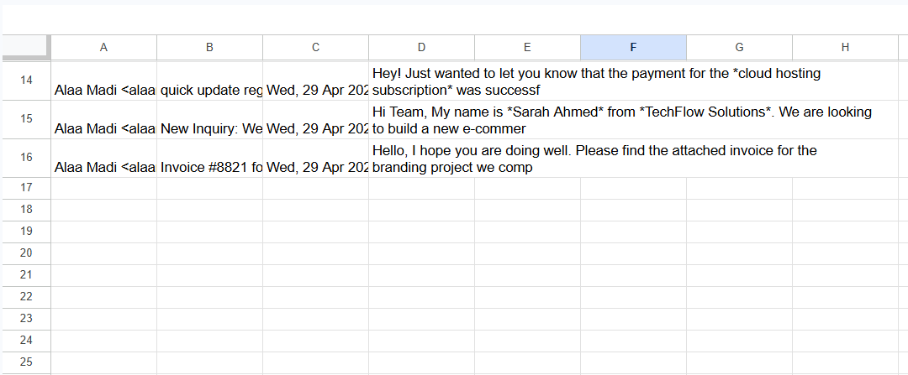

# Email Automation Agent 📧

A Python-based email automation tool that fetches unread emails from Gmail, extracts key information (sender, subject, date, and preview), and automatically stores the data in Google Sheets. Perfect for managing business emails and organizing communication workflows.

## 🌟 Features

- **Gmail Integration**: Automatically fetches unread emails from your Gmail inbox
- **Data Extraction**: Extracts sender name, subject, date, and email preview
- **Google Sheets Sync**: Automatically appends email data to a Google Sheet for easy tracking
- **Real-time Processing**: Process and organize emails on-demand
- **Error Handling**: Robust fallback mechanisms for API failures
- **OAuth 2.0 Authentication**: Secure authentication with Google services

## 🎯 Use Cases

- **Customer Support**: Track incoming support emails automatically
- **Sales Pipeline**: Monitor sales inquiries and follow-ups
- **Email Analytics**: Collect email data for analysis and reporting
- **Workflow Automation**: Reduce manual email data entry
- **Business Intelligence**: Centralize email communications in a spreadsheet

## 🛠️ Tech Stack

- **Language**: Python 3.8+
- **APIs**: 
  - Google Gmail API
  - Google Sheets API
  - Google Generative AI (Gemini)
- **Libraries**:
  - `google-api-python-client`
  - `google-auth-oauthlib`
  - `python-dotenv`
  - `google-genai`

## 📋 Prerequisites

Before you start, make sure you have:

1. **Python 3.8 or higher** installed
2. **Google Account** with Gmail
3. **Google Cloud Project** created
4. **API Keys** generated:
   - Gmail API enabled
   - Sheets API enabled
   - Gemini API key (optional)

## 🚀 Installation

### 1. Clone the Repository

```bash
git clone https://github.com/alaamadii/email-automation-agent.git
cd email-automation-agent
```

### 2. Create Virtual Environment

```bash
python -m venv venv
source venv/Scripts/activate  # On Windows
# or
source venv/bin/activate      # On macOS/Linux
```

### 3. Install Dependencies

```bash
pip install -r requirements.txt
```

### 4. Set Up Google Cloud

1. Go to [Google Cloud Console](https://console.cloud.google.com/)
2. Create a new project
3. Enable APIs:
   - Gmail API
   - Google Sheets API
   - Generative Language API (optional)
4. Create OAuth 2.0 credentials (Desktop application)
5. Download credentials as `credentials.json`
6. Place `credentials.json` in the project root directory

### 5. Configure Environment Variables

Create a `.env` file in the project root:

```env
GEMINI_API_KEY=your_gemini_api_key_here
SPREADSHEET_ID=your_google_sheet_id_here
```

**How to find your Spreadsheet ID:**
1. Open your Google Sheet in your browser
2. Look at the URL in the address bar
3. The ID is the long string between `/d/` and `/edit`
4. Example: `https://docs.google.com/spreadsheets/d/1vc_IE1aifAXj5obpjZAoymEMpcpjTmGqI0_qS4c6RZI/edit`
   - In this case, the ID is: `1vc_IE1aifAXj5obpjZAoymEMpcpjTmGqI0_qS4c6RZI`
5. Copy and paste this ID into your `.env` file as `SPREADSHEET_ID`

## 📖 Usage

### Basic Usage

Run the script to fetch and process unread emails:

```bash
python main.py
```

### First Run

On the first run, you'll be prompted to authorize the application:

1. A browser window will open with Google's authorization page
2. Click "Allow" to grant permissions
3. A `token.json` file will be created for future authentication

### What It Does

1. ✅ Connects to your Gmail inbox
2. ✅ Fetches up to 3 unread emails
3. ✅ Extracts: Sender, Subject, Date, Email Preview
4. ✅ Writes data to Google Sheets automatically

### Output Example

Your Google Sheet will have columns like:

| Sender | Subject | Date | Summary |
|--------|---------|------|---------|
| john@example.com | Project Update | Mon, 29 Apr 2024 | We have completed the initial phase... |
| support@client.com | Inquiry: Pricing | Mon, 29 Apr 2024 | Hello, we would like to know more about... |

## � Screenshots




## �📁 Project Structure

```
email-automation-agent/
├── main.py                 # Main application script
├── credentials.json        # Google OAuth credentials (auto-created)
├── token.json              # Authentication token (auto-created)
├── .env                    # Environment variables
├── .gitignore              # Git ignore file
├── requirements.txt        # Python dependencies
└── README.md               # This file
```

## 🔑 Key Functions

### `authenticate_google()`
Handles OAuth 2.0 authentication with Google services. Creates or refreshes authentication tokens.

### `extract_email_info(payload, body)`
Extracts sender, subject, date, and email preview from raw email data.

### `main()`
Main function that orchestrates the entire workflow: authenticate → fetch emails → extract data → write to sheets.

## ⚙️ Configuration Options

You can modify these in `main.py`:

```python
SCOPES = [
    'https://www.googleapis.com/auth/gmail.readonly',  # Gmail read access
    'https://www.googleapis.com/auth/spreadsheets'      # Sheets write access
]
```

**Change email fetch limit:**
```python
maxResults=3  # Change to fetch more/fewer emails
```

**Change search criteria:**
```python
q='is:unread'  # Gmail search query (can use: is:read, from:, subject:, etc.)
```

## 🔒 Security Best Practices

1. **Never commit credentials**: `.gitignore` already includes `credentials.json` and `token.json`
2. **Protect your API keys**: Store them in `.env` file, never in code
3. **Rotate credentials**: Periodically regenerate API keys in Google Cloud Console
4. **Limit scopes**: Only request necessary permissions from Gmail API

## 🐛 Troubleshooting

### Issue: "Module not found" errors
**Solution**: Ensure all dependencies are installed
```bash
pip install -r requirements.txt
```

### Issue: "Request had insufficient authentication scopes"
**Solution**: Delete `token.json` and re-run to re-authenticate with updated scopes
```bash
del token.json
python main.py
```

### Issue: "Spreadsheet not found"
**Solution**: Verify `SPREADSHEET_ID` in `.env` file matches your actual Google Sheet

### Issue: "API quota exceeded"
**Solution**: Wait for quota to reset or upgrade your Google Cloud billing

## 🚀 Future Enhancements

- [ ] Schedule automatic email checks (via APScheduler)
- [ ] Support for multiple email accounts
- [ ] Advanced email filtering and categorization
- [ ] Attachment handling and storage
- [ ] Email labeling and automated actions
- [ ] Web dashboard for monitoring
- [ ] Database integration (PostgreSQL/MongoDB)
- [ ] Slack/Teams notifications for new emails
- [ ] Natural language processing for sentiment analysis

## 📝 Example Workflow

```
1. User runs: python main.py
   ↓
2. Script authenticates with Google (using token.json or prompts for OAuth)
   ↓
3. Connects to Gmail API and fetches 3 unread emails
   ↓
4. Extracts: From, Subject, Date, Email Content Preview
   ↓
5. Writes data to specified Google Sheet
   ↓
6. Prints success message
   ↓
7. Data is now available in Google Sheets for analysis/reporting
```

## 📊 API Calls & Limits

- **Gmail API**: 1 billion quota units/day (Free tier)
- **Sheets API**: 300 requests/min (Free tier)
- **Gemini API**: Limited free tier (applies if using AI analysis)

## 🤝 Contributing

Contributions are welcome! Please:

1. Fork the repository
2. Create a feature branch (`git checkout -b feature/amazing-feature`)
3. Commit your changes (`git commit -m 'Add amazing feature'`)
4. Push to the branch (`git push origin feature/amazing-feature`)
5. Open a Pull Request

## 📄 License

This project is licensed under the MIT License - see the LICENSE file for details.

## 👨‍💻 Author

**Alaa Madi**
- GitHub: [@yourusername](https://github.com/alaamadii)
- Email: alaamadi005@gmail.com

## 🙏 Acknowledgments

- Google Cloud Platform for APIs
- Open source community for libraries used
- [Gmail API Documentation](https://developers.google.com/gmail/api)
- [Sheets API Documentation](https://developers.google.com/sheets/api)


---

⭐ **If you found this project helpful, please consider giving it a star!**
